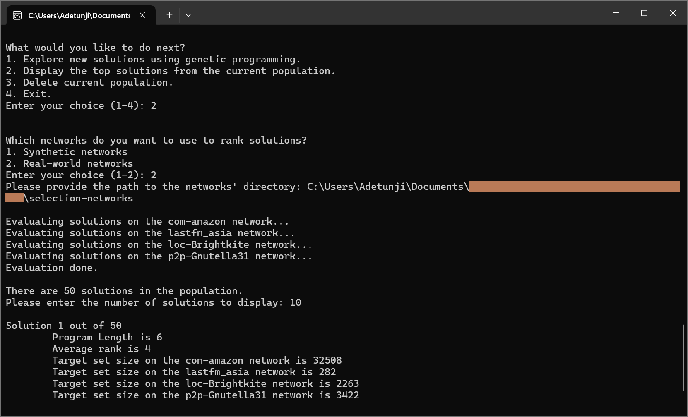
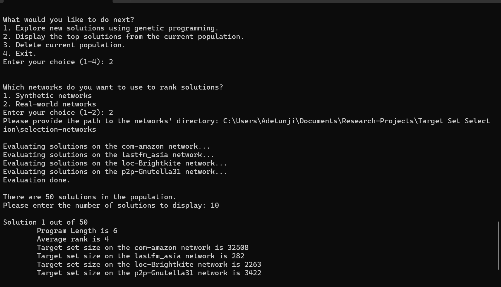

# Discovering Fast and Effective Heuristics for Social Influence Maximization through Genetic Programming

[](https://papers.ssrn.com/sol3/papers.cfm?abstract_id=5588215)

This repository accompanies the research paper  **“Discovering Fast and Effective Heuristics for Social Influence Maximization through Genetic Programming”**,  available as a preprint on [SSRN](https://papers.ssrn.com/sol3/papers.cfm?abstract_id=5588215).

---

## Overview

Given a social network, which nodes should be selected to maximize information spread? This project studies a variant of the **Social Influence Maximization** problem known as **Target Set Selection (TSS)** — which seeks a small set of individuals whose initial adoption of a behavior triggers its full-network adoption. Search-based heuristics often yield small target sets but are computationally expensive, while one-shot construction heuristics are faster but typically produce larger sets. 

This project bridges the efficiency–effectiveness gap by applying **Genetic Programming (GP)** to automatically discover one-shot heuristics that rival or outperform expert-designed ones. From this process emerges **ELPH (Evolved Priority Heuristic)** that achieves smaller target sets than existing one-shot methods and, when paired with a **Shapley value–based pruning** technique, approaches the performance of computationally intensive search-based methods.

We implemented the framework in **C#** due to its strong support for **runtime code compilation and execution**, allowing dynamic generation, compilation, and evaluation of candidate heuristics within the GP loop.

---

## Project Structure
```text
.
├── source/                 # Contains the two C# console projects
│   ├── HeuristicGen/       # Genetic Programming framework for evolving heuristics
│   └── TSSBenchmark/       # Benchmark suite for evaluating discovered heuristics
│
├── networks/               # Preprocessed real-world benchmark networks
├── selection-networks/     # Networks used for heuristic selection
└── outputs/                # Checkpoints, logs, and benchmark results
```
---

## Running the Projects

### Prerequisites
- [.NET 8 SDK](https://dotnet.microsoft.com/download)
- Windows, macOS, or Linux terminal with `dotnet` command available

### Build and Run

From the repository root, navigate to either project directory and run in **Release** mode:

```bash
cd source/HeuristicGen
dotnet run -c Release
```
or 
```bash
cd source/TSSBenchmark
dotnet run -c Release
```

Both programs are interactive console applications that prompt for configuration parameters and display progress/results in the terminal.

## Example Runs

Below are screenshots demonstrating the workflow of one of the applications.

### 1. Evolving Heuristics
The console interface allows users to input genetic programming parameters such as population size, number of generations, and fitness settings.



---

### 2. Viewing Evolved Heuristics
After evolution completes, the discovered heuristics can be displayed. The gif below shows a sample run visualizing the heuristics found.

